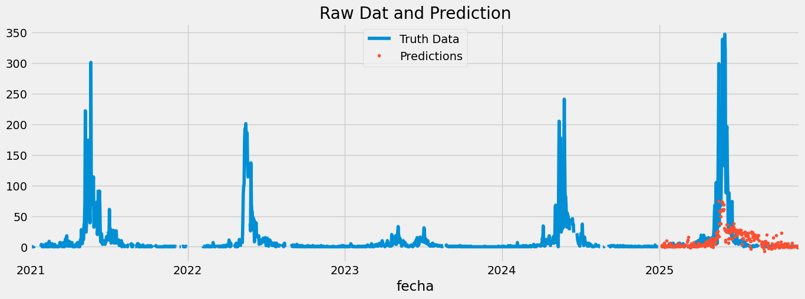
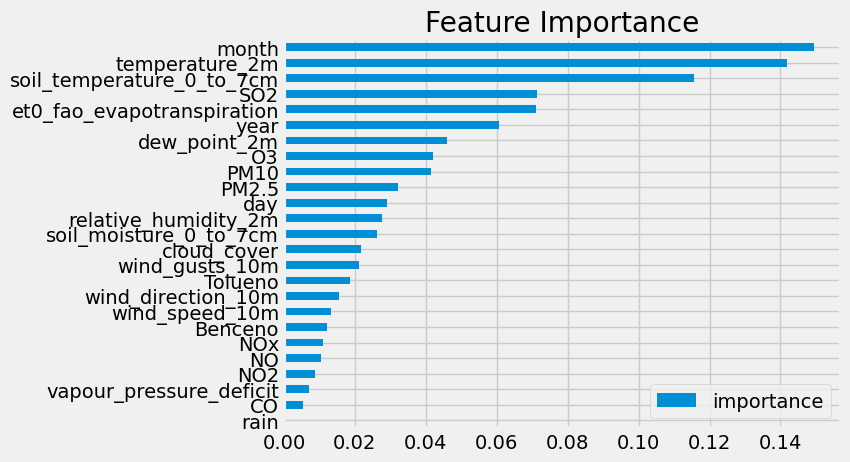
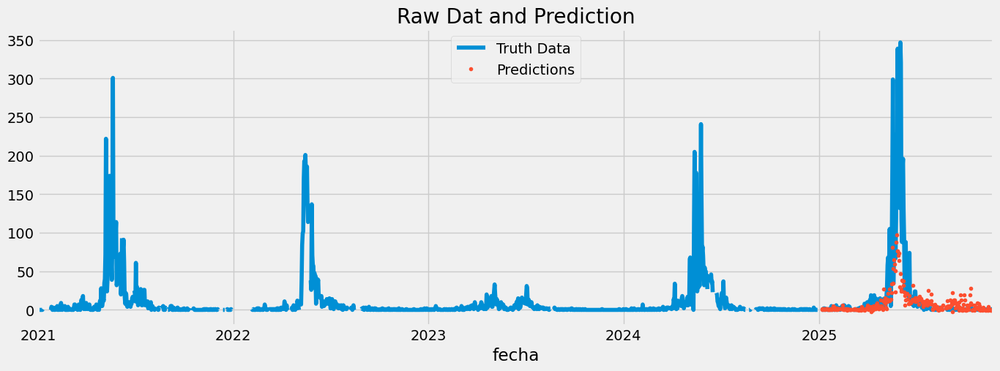
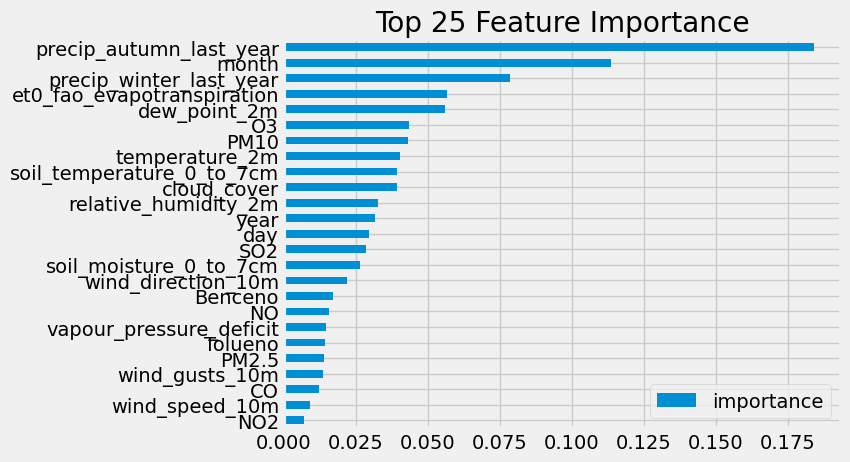
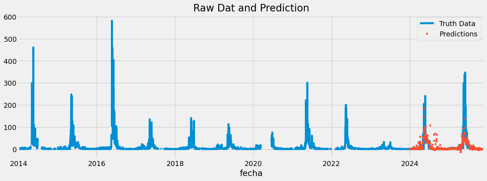
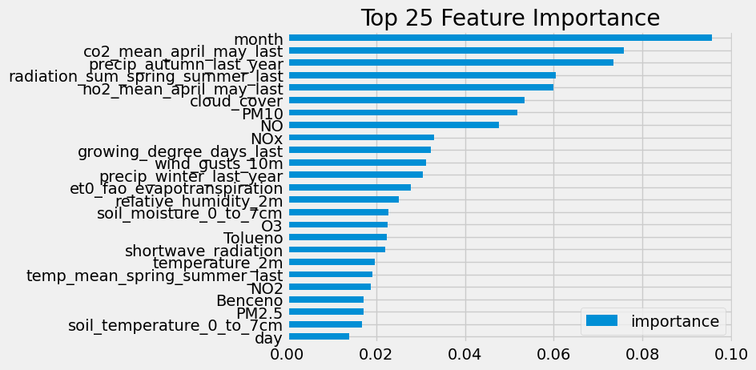

## 📄Investigación sobre polen y contaminantes
Principales alérgenos de polen en Madrid:
- Gramíneas (principal)
- Cupresáceas
- Olivo
- Plátano de paseo
- Quenopodiáceas
- Urticáceas
---
 
### Principales contaminantes en las ciudades (¿Porque hay mas polen en las ciudades?):
(Lo que usaré para predecir)

Instantáneo:
- NO2/NOx: El nitrógeno hace que la planta libere 5 o 6 veces más de polen (y contiene mayor proporción de proteinas alergénicas).
- O3: Ozono (troposférico): Hacen sentir estrés a las plantas, liberan “proteinas del estrés” que hacen al polen más alérgico (por las proteinas de defensa), sin embargo también reduce el nectar.
- PM_10/PM_2.5: Las partículas al emitir diesel pueden actuar como vehículos. Además al entrar en contacto con el diesel, el polen se libera más fácilmente de las plantas.
- El SO2 por otro lado no hace que haya más polen pero si produce hiperreactividad en las personas al polen (idea para otra app).

A más largo plazo:

- El CO2 favorece la fotosíntesis y la producción total del polen.
---
### Otros agravantes generales:
A corto plazo:

- Viento: Dispersa los granos de polen.

    Existen 3 formas de polinización (pero solo una nos interesa)
    

- Humedad y tormenta: En estos casos el polen se parte en cachos más pequeños (ya que se hincha al absorber agua y explota).
- Radiación solar: Se requiere para la antesis matutina. También alimanta la planta para la fotosíntesis y crea ozono (estresando la planta).
- A corto plazo la lluvia hace efecto lavado y elimina el polen.

A largo plazo:
- La lluvia produce una mayor concentración de polen anual.
- Media de los útlimos días (por inercia).

Variables que debo crear yo:
- "Memoria Biológica": Genera variables basadas en las condiciones climáticas del año anterior (Year Y-1) que afectan la producción actual de polen, como la precipitación acumulada en otoño/invierno o los días de sequía en verano.
- Las altas temperaturas y menos lluvia adelanta la floración y retrasa la finalización “GDD” (Growing Degree Days). (Las plantas necesitan acumular calor para el periodo de floración, entonces a mayor temperatura antes florece). 54,8 % más de polen.

## 📡Fuentes de datos
- Para polen por tipos PolinoCam “AYTM” (Gramíneas, platano de paseo, etc.)
    
    https://datos.comunidad.madrid/dataset/mediciones_polen
    
- Para datos de meteorología OpenMeteo (humedad, temperatura, etc.)
    
    https://open-meteo.com/
    
- Para datos de contaminantes:
    - OpenMeteo tiene datos, pero no muchos
    - IQAir, es de pago para datos pasados
    - Catálogo de datos de la comunidad de Madrid (solo provincias lejanas al centro)
    - Catálogo de datos del ayuntamiento de Madrid (este es el bueno)
        
        https://datos.madrid.es/portal/site/egob/menuitem.c05c1f754a33a9fbe4b2e4b284f1a5a0/?vgnextoid=aecb88a7e2b73410VgnVCM2000000c205a0aRCRD&vgnextchannel=374512b9ace9f310VgnVCM100000171f5a0aRCRD&vgnextfmt=default

## 📂 Estructura
- `original_datasets/...`: Carpeta con todos los datasets necesarios originales (Desde 2021 a 2025)

- `new_datasets/...`: Carpeta con los datasets unificados y tratados por mí

- `prepare_data.ipynb`: Notebook en el que he correlacionado los datos y los he tratado para poder ser tratados por el modelo (mismo tipo de fecha, buena estructura, etc.)
- `addCustomParams`: Notebook en el que añado las variables creadas por mí al dataset.

- `predict.ipynb`: Notebook encargado de crear el modelo XGBoost (entrenarlo).

## 📊 Análisis y Evaluación (data.ipynb)

**Pérdida de correlación lineal:** La relación parece "mala" matemáticamente porque el polen tiene un ciclo biológico limitado. Una vez que el árbol ha soltado todo su polen, por mucho que suba la contaminación, el polen ya no subirá más, rompiendo la línea recta de la correlación.

.png>)
---

Polen Gramineas (2022-2025):
.png>)

Polen cupresaceas (2022-2025):
.png>)

Polen olivo (2022-2025):
.png>)

Polen plátano de paseo (2022-2025):
.png>)

Polen quenopodiánceas (2022-2025):
.png>)

Polen urticáceas (2022-2025):
.png>)

## 🤖 Creación del modelo

Voy a hacer uso de XGBoost, ya que es uno de los mejores algoritmos para aprendizaje supervisado.

### Primer modelo (solo variables de los datasets)

R2 Score 0.26

### Segundo modelo (con marcadores biológicos "otros años")

R2 Score 0.34 (Las apps requieren como mínimo un 0.35)

### Tercer modelo (con más datos y ajustes)

R3 Score 0.41 (0.45 ya es el estándar de las apps, como BreezoMeter que escanea las zonas)

Esto es así porque el polen es algo dificil de predecir, por ejemplo debes medir la humedad exacta de la tierra para decidir si la planta va a expulsar polen hoy o no.

## 🛠️ Plan para la aplicación
Crear la aplicación según una de estas opciones:
- Crear una aplicación que según el tipo de polen al que es alérgico, prediga como se sentirá los próximos días. (Necesario para saber cuando tomar la pastilla de la alergia).
- Como hay variables que no se miden según la cantidad de polen, como el SO2 que aumenta la hiperreactividad, crear una aplicación donde la gente muestre si se encuentra peor o mejor, y así tener más datos para mejorar el modelo a la hora de predecir como se encontrará la gente.